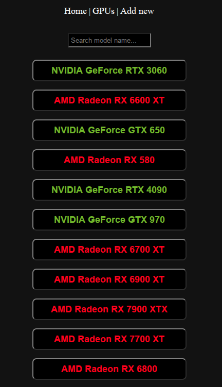
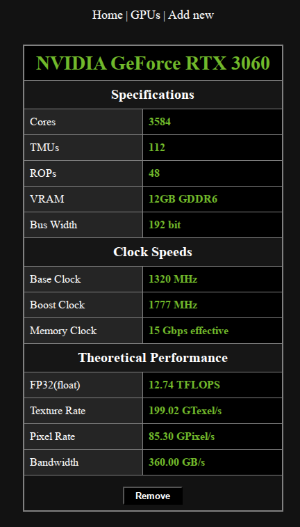

# GPU Manager

Simple GPU List style app to train Next.js.

## Table of Contents
- [About](#about)
- [Setup](#setup)
- [Usage](#usage)
- [API Requests](#api-requests)
- [Integration tests](#integration-tests)


## About

### Screenshots

<div>
  
  
</div>


## Setup

- Install dependencies
  ```bash
  cd ./gpu-manager && npm install
  ```

- Setup the `/gpu-manager/.env` file with the following variables
  ```conf
  MONGODB_URI=<mongodb_uri>
  TEST_MONGODB_URI=<test_mongodb_uri>
  ```


## Usage

### Development mode
- Start the app (supports hot reload)
  ```bash
  npm run dev
  ```

- Web UI: http://localhost:3000

### Production mode

- Build the app
  ```bash
  npm run build
  ```

- Start the app
  ```bash
  npm run start
  ```

- Web UI: http://localhost:3000


## API requests

- Fetch all available cards
  ```bash
  curl -X GET http://localhost:3000/api/gpus
  ```

- Fetch a single card by its id
  ```bash
  curl -X GET http://localhost:3000/api/gpus/<id>
  ```

- Add a new graphics card
  ```bash
  curl -X POST http://localhost:3000/api/gpus \
    -H "Content-type: application/json" \
    -d '{ "manufacturer": "NVIDIA", "gpuline": "GeForce", "model": "RTX 5090", \
          "cores": 21760, "tmus": 680, "rops": 176, "vram": 32, "bus": 512, \
          "memtype": "GDDR7", "baseclock": 2017, "boostclock": 2407, "memclock": 28 }'
  ```

- Update a graphics card data (one or more fields)
  ```bash
  curl -X PATCH http://localhost:3000/api/gpus/<id> \
    -H "Content-type: application/json" \
    -d '{ "model": "RTX 4090", "cores": 16384 }'
  ```

- Remove a graphics card from the database
  ```bash
  curl -X DELETE http://localhost:3000/api/gpus/<id>
  ```


## Integration tests

- Start the app in testing mode
  
  - With hot reloading
    ```bash
    npm run dev:test
    ```

  - Using the production build
    ```bash
    npm run build && npm run start:test
    ```

- Run all test suites
  ```bash
  npm run test
  ```

- Run a single test suite
  ```bash
  npm run test -- ./tests/integration/get_route.test.ts
  ```
